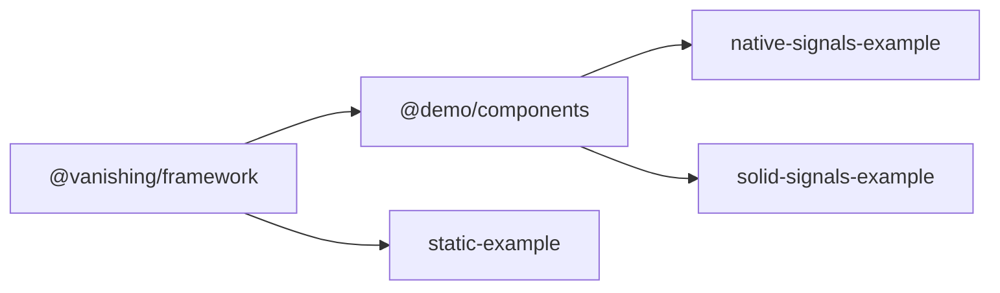

# HTML Templating Framework

An experimental web framework exploring the intersection of emerging web standards for signals and template parts.

## Background

The modern web platform has a significant gap when it comes to reactive templating and state management. While frameworks like React, Vue, and Solid have demonstrated the value of reactive primitives and efficient DOM updates, these capabilities haven't been available as native web standards—until now.

### The Standards Gap

Currently, web developers face two key challenges:

1. **Templating**: While the platform provides basic templating through `<template>` elements, there's no standard way to efficiently update parts of instantiated templates when data changes.

2. **Reactivity/Signals**: There's no native way to create reactive state that automatically triggers UI updates when values change. This has led to countless framework-specific implementations.

### Emerging Standards

This project is inspired by and aligned with emerging web standards that aim to close these gaps:

- **[DOM Parts](https://github.com/WICG/webcomponents/blob/gh-pages/proposals/DOM-Parts.md)**: A proposal for efficiently marking and updating specific parts of the DOM tree, enabling frameworks to surgically update only the parts that need to change.

- **[Signals Standard](https://github.com/proposal-signals/proposal-signals)**: A TC39 proposal bringing reactive primitives to JavaScript, providing a standard way to create observable values that notify when they change.

These standards promise to enable lightweight, framework-less reactive applications with near-native performance.

## Project Goals

This experimental framework aims to:

- Explore practical implementations of the emerging signals and DOM parts standards
- Provide a lightweight reactive templating solution inspired by these standards
- Demonstrate how these primitives can work together for efficient UI updates
- Experiment with ergonomic APIs for developers

## Inspiration

The implementation draws inspiration from:

- **Emerging Web Standards**: DOM Parts and TC39 Signals proposals
- **[Arrow-js](https://www.arrow-js.com/)**: A lightweight reactive framework that demonstrates elegant reactive templating patterns

## Project Structure

```
packages/
  framework/          # Core templating and reactive framework (@vanishing/framework)
    src/template/     # Template instantiation and DOM parts implementation
    src/reactive/     # Signal-based reactivity system
    src/wc/           # Web Components integration
  demo-components/    # Reusable demo components (@demo/components)

apps/
  native-signals-example/   # Example using native signals runtime
  solid-signals-example/    # Example using Solid.js signals
  static-example/           # Static rendering example (no reactivity)
```

### Dependency Chain

`@vanishing/framework` → `@demo/components` → example apps



## Getting Started

### Prerequisites

- Node.js 22 or later
- npm 10 or later

### Installation

1. Clone the repository
2. Install dependencies from the workspace root:

```bash
npm install
```

1. Build packages (required before first run):

```bash
npm run build:packages
```

## Scripts

### Development (with HMR/watch mode)

Development mode continuously rebuilds packages when source files change and runs the Vite dev server with hot module replacement.

```bash
# Full development: watch-build all packages + run native-signals-example
npm run dev

# Watch-build packages only (for working with apps separately)
npm run dev:packages

# Run a specific app with package watching
npm run dev:native   # native-signals-example
npm run dev:solid    # solid-signals-example  
npm run dev:static   # static-example
```

### Production (build + preview)

Production mode builds optimized bundles and serves via Vite's preview server.

```bash
# Build everything and serve native-signals-example
npm start

# Build packages and serve a specific app
npm run start:native
npm run start:solid
npm run start:static
```

### Building

```bash
# Build all packages and apps
npm run build

# Build only the library packages (framework + demo-components)
npm run build:packages

# Build a specific workspace
npm run build -w @vanishing/framework
npm run build -w @demo/components
npm run build -w native-signals-example
```

### Testing

```bash
# Run tests across all workspaces
npm test

# Run tests for a specific package
npm test -w @vanishing/framework
```

## Status

This is an experimental project exploring future web standards. The APIs and implementation are subject to change as the underlying standards evolve.

## Learn More

- [DOM Parts Proposal](https://github.com/WICG/webcomponents/blob/gh-pages/proposals/DOM-Parts.md)
- [TC39 Signals Proposal](https://github.com/proposal-signals/proposal-signals)
- [Arrow-js Documentation](https://www.arrow-js.com/)
