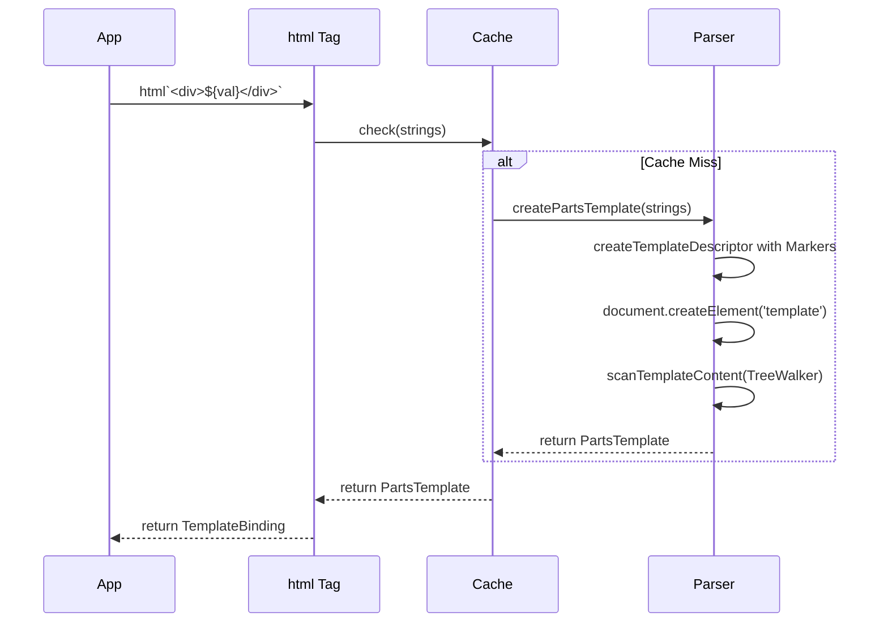

# Vanishing Framework Templating Guide

This document explains how the framework turns `html` tagged templates into live DOM backed by fine-grained reactivity.

## 1. High-Level Flow

```text
(template literal) --> html() --> TemplateBinding
                          |
                          v
                  getPartsTemplate()
                          |
                          v
                binding.instance()
                          |
                          v
              NodePart/AttributePart setValue()
                          |
                          v
                DOM updates via PartRuntime
```

Each stage runs once per component instantiation, while reactive updates flow directly to individual parts without re-parsing templates.

## 2. Authoring Templates with `html`

`html` behaves like lit-html: call it inside your component with static markup plus dynamic placeholders.

```ts
const card = html`
  <article class="card">
    <h2>${() => title()}</h2>
    <p>${() => description()}</p>
    <button onclick=${onClick}>Launch</button>
  </article>
`;
```

### What `html` Produces

- A `TemplateBinding` containing
  - `strings`: the static literal chunks.
  - `values`: the dynamic expressions.
  - `runtime`: the reactive runtime to use for effects.
- A cached `PartsTemplate` per unique `strings` array.

## 3. Template Parsing and Caching

When the framework sees a new `strings` array it:

1. Concatenates the strings while inserting comment markers for node expressions and synthetic attribute markers for attribute expressions.
2. Parses the result once via `<template>.innerHTML`.
3. Walks the DOM using `TreeWalker` to find comment and attribute placeholders and stores their DOM paths in descriptors.
4. Stores the resulting `TemplateRecord` in a `WeakMap`, so future uses skip parsing entirely.

### Marker Anatomy

```text
Node Part Marker       : <!--part:INDEX-->
Attribute Part Marker  : "%%PART:INDEX%%"
```

The `INDEX` matches the expression order in the original template literal.

#### Visualizing the Parse Flow



## 4. Instantiation (`.instance()`)

`binding.instance()` creates a live DOM instance from a `TemplateBinding`:

1. Loads the cached `PartsTemplate` for the `binding.strings`.
2. Clones the template's `DocumentFragment`.
3. Reconstructs real `NodePart` and `AttributePart` instances by resolving descriptor paths against the clone.
4. Iterates through `binding.values`:
   - Functions (signals/effects) become tracked reactions via `runtime.effect`.
   - Event handlers get their own disposal tracking.
   - All other values are written once.
5. Returns `{ fragment, parts, dispose }`, where `dispose` tears down every effect and cleans up event listeners.

### Visualizing Instantiation

```mermaid
flowchart TD
    A[TemplateBinding] --> B{Check Cache}
    B -- Found --> C[Get PartsTemplate]
    B -- New --> D[Create & Parse]
    D --> C
    C --> E[Clone DOM Fragment]
    C --> F[Traverse Descriptors]
    F --> G[Resolve Paths in Clone]
    G --> H{Create Part}
    H -- Node --> I[NodePart]
    H -- Attribute --> J[AttributePart]
    I --> K[Bind Values]
    J --> K
    K -- Value is Signal --> L[Create Effect]
    K -- Value is Static --> M[Set Initial Value]
    L -->N[Signal Update] --> O[part.setValue()]
```

## 5. Part Types

### NodePart

- Owns a pair of comment sentinels (`part-start` / `part-end`).
- Supports:
  - Text (`string` / `number`)
  - DOM nodes
  - Nested `TemplateBinding` instances (recursively instantiated)
  - Iterables (lists of primitives, nodes, or templates)
  - `null` / `false` (clears the part)
- Tracks child template disposers so nested templates clean up when their parent changes.

### AttributePart

- Targets a single attribute/property/event on an element.
- Modes:
  - Property binding: `.value=${expr}` writes to element properties.
  - Event binding: `onclick=${handler}` attaches listeners without wrapping.
  - Plain attributes: set/remove/toggle string values.
- Event parts skip reactive wrapping to avoid re-subscribing handlers on each update.

## 6. Reactive Runtime Adapter

`PartRuntime` is an interface that provides reactive primitives:

```ts
interface PartRuntime {
  effect(run: () => void): () => void;
  createSignal<T>(initial: T): Signal<T>;
  createMemo<T>(fn: () => T): Memo<T>;
  batch<T>(fn: () => T): T;
  untrack<T>(fn: () => T): T;
  onCleanup(fn: () => void): void;
}
```

- Create runtime-specific template functions using `TemplateBinding.with(runtime)`:

  ```ts
  export const html = TemplateBinding.with(myRuntime);
  ```

- Create runtime-specific state decorators using `StateDecorator.with(runtime)`:

  ```ts
  export const state = StateDecorator.with(myRuntime);
  ```

- Each `TemplateBinding` carries its runtime, so nested templates inherit it automatically.
- No global state—each component can use a different runtime if needed.

### Reactive Lifecycles

```text
value is a function --> runtime.effect(() => part.setValue(value()))
value is static     --> part.setValue(value)
```

The runtime decides when to re-run `part.setValue`, ensuring updates target only the affected DOM nodes.

## 7. Nested Templates & Lists

Because `NodePart` understands `TemplateBinding` values and generic iterables, you can compose declarative lists without manual DOM work:

```ts
html`
  <ul>
    ${() => items().map((label, index) => html`
      <li>
        <span>${label}</span>
        <button onclick=${() => remove(index)}>Remove</button>
      </li>
    `)}
  </ul>
`;
```

- Every nested `html` call becomes its own template instance.
- The parent `NodePart` tracks all child disposers, so removing or reordering items cleans up effects immediately.
- Iterables can be nested arbitrarily; values that are `null`/`false` are skipped automatically.

### Keyed Lists

If you want to keep DOM nodes/effects alive while reordering or splicing lists, wrap each item in the exported `keyed()` helper so `NodePart` can reconcile by key:

```ts
import { html, state } from '../runtime/native-runtime.js';

html`
  <ul>
    ${() => items().map(item => html`
      <li>
        <span>${item.label}</span>
        <button onclick=${() => remove(item.id)}>Remove</button>
      </li>
    `.setKey(item.id))}
  </ul>
`;
```

- Existing keys keep their DOM and reactive disposers intact; only moved nodes are reordered, and removed keys are disposed.
- Entries without `keyed()` still use the simpler “clear and rebuild” path, so this is fully opt-in.

## 8. Putting It Together in `ReactiveElement`

`ReactiveElement` subclasses typically:

1. Declare signals/state using runtime-specific `@state` decorator.
2. Implement `template()` and return a runtime-specific `html` result.
3. Call `super.connectedCallback()` (handled automatically) which:
   - Calls `binding.instance()` to create the DOM.
   - Mounts the fragment into the component’s shadow DOM.
   - Stores the disposer for `disconnectedCallback()`.

```text
connectedCallback
    |
    v
 template()  --> TemplateResult
    |
    v
 instantiate() --> fragment + dispose
    |
    v
 shadowRoot.replaceChildren(fragment)
```

This lifecycle ensures templates are parsed once, mounted once, and then updated through fine-grained reactivity.

## 9. Tips for Authors

- Prefer functions for reactive expressions (`${() => count()}`) and plain values for static content.
- Use property bindings or events for non-string attributes (`.value=${signal}` or `onclick=${handler}`).
- Compose nested templates for lists instead of manual DOM APIs—the framework now handles disposal for you.
- When integrating third-party reactive systems, implement the `PartRuntime` interface and create runtime-specific factories:

  ```ts
  export const html = TemplateBinding.with(myRuntime);
  export const state = StateDecorator.with(myRuntime);
  ```

With these building blocks you can create lit-style declarative templates backed by Solid-style fine-grained reactivity while keeping the runtime tiny and explicit.
